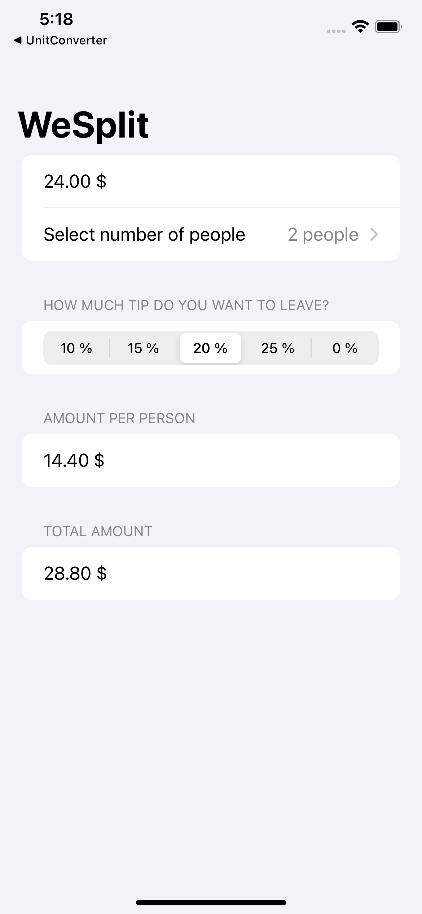
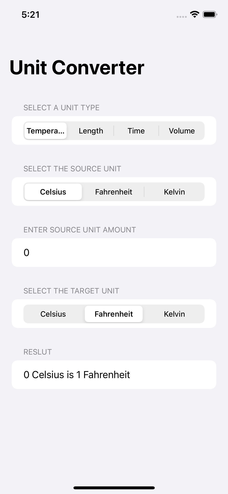
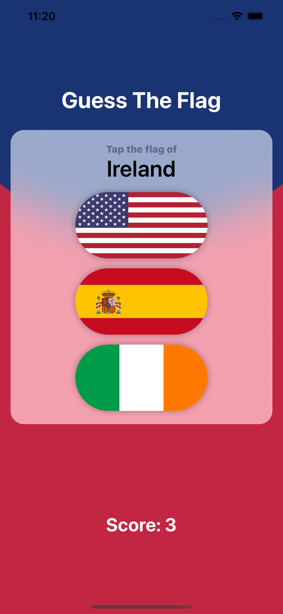
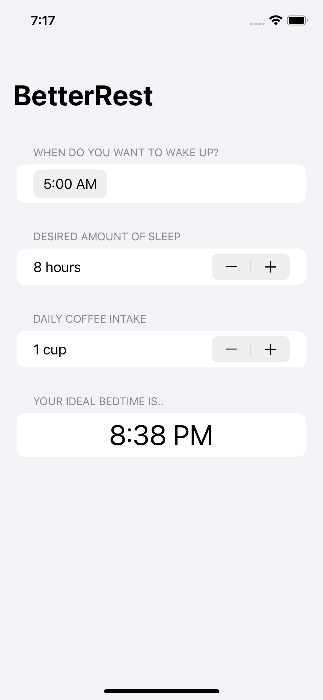

# 100DaysOfSwiftUI
A collection of iOS applications I built following the 100DaysOfSwfitUI course series from Paul Hudson's [HackingWithSwift](https://www.hackingwithswift.com/100/swiftui/).

This collection contains also apps I built from scratch following 100DaysOfSwfitUI's project challenges.

## WeSplit
This project is a check-sharing app that calculates how to split a check based on the number of people and how much tip you want to leave.

## UnitConverter
An app that handles unit conversions: users will select an input unit and an output unit, then enter a value, and see the output of the conversion.

TODO: implement a generic function to calculate the unit conversions.

## GuessTheFlag
A guessing game that helps users learn some of the many flags of the world.

## BetterRest
A small app designed to help coffee drinkers get a good night’s sleep by asking them three questions:

- When do they want to wake up?
- Roughly how many hours of sleep do they want?
- How many cups of coffee do they drink per day?

Once we have those three values, we’ll feed them into Core ML to get a result telling us when they ought to go to bed.

